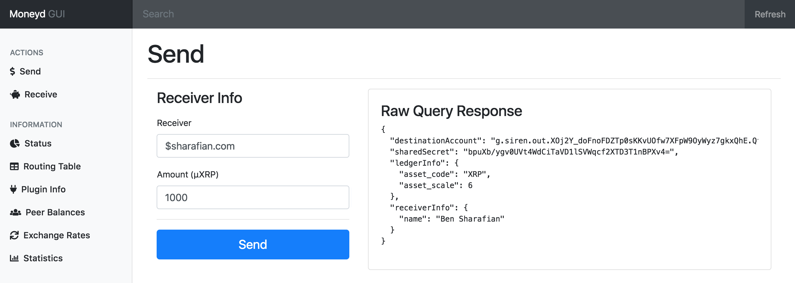

# Moneyd GUI
> A GUI for Moneyd

- [Usage](#usage)
- [TODOs](#todos)




## Usage

```sh
git clone git@github.com:sharafian/moneyd-gui.git
cd moneyd-gui
npm install
npm start
```

Then go to [localhost:7770](http://localhost:7770) in your browser.

## TODOs

- [ ] spiffier transitions?
- [ ] better 404 page
- [ ] better 500 page (instruct to turn on moneyd with flag)
- [ ] health check for moneyd by using plugin btp?
- [ ] ping tool
- [ ] send tool
- [ ] receive tool
- [x] implement statistics
- [ ] align icons and labels properly
- [ ] highlight selected item in nav
- [ ] make exchange rates more of a grid
- [ ] some visualizations?
- [ ] links to tutorials
- [ ] web monetization health
