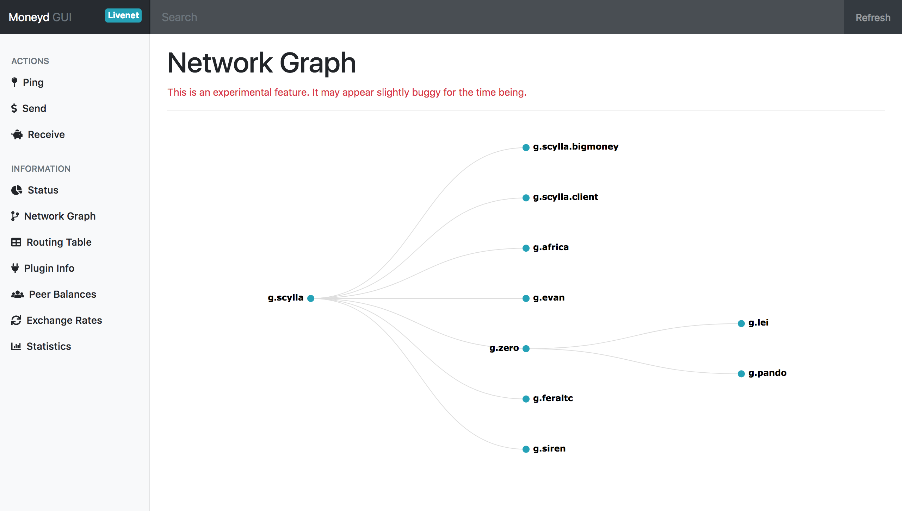

# Moneyd GUI
> A GUI for Moneyd

- [Usage](#usage)
- [Environment Variables](#environment-variables)
- [TODOs](#todos)
- [More Screenshots](#more-screenshots)


## Usage

```sh
git clone git@github.com:interledgerjs/moneyd-gui.git
cd moneyd-gui
npm install
npm start
```

Make sure you start Moneyd with `--admin-api-port 7769`.

Then go to [localhost:7770](http://localhost:7770) in your browser.

## Environment Variables

| Variable | Default | Purpose |
|:--|:--|:--|
| `PORT` | 7770 | Port to host the GUI's webserver on |
| `ADMIN_API_PORT` | 7769 | Port for moneyd's admin API. Set with `--admin-api-port` in moneyd |

## TODOs

- [ ] CORS
- [x] live update on receiver page
- [ ] live update on balances
- [ ] spiffier transitions?
- [x] better 404 page
- [x] better 500 page (instruct to turn on moneyd with flag)
- [ ] health check for moneyd by using plugin btp?
- [x] ping tool
- [x] network indicator
- [x] send tool
- [x] receive tool
- [x] implement statistics
- [ ] align icons and labels properly
- [ ] highlight selected item in nav
- [ ] make exchange rates more of a grid
- [ ] some visualizations?
- [ ] links to tutorials
- [ ] web monetization health

# More Screenshots

#### Send SPSP Payments


#### View Routing Table Info


#### Receive SPSP Payments


#### Network Graph

_The network graph is a visualization of your node's routing table. It doesn't
represent a complete view of the network._


